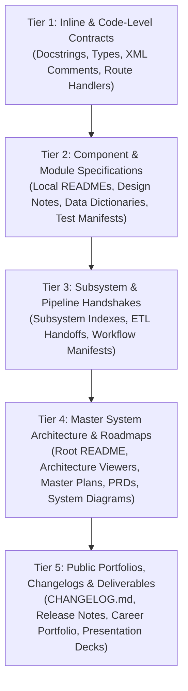
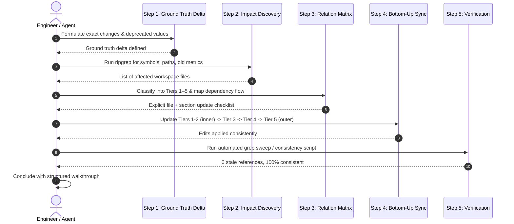

# Universal Cross-Document Synchronization & Consistency Protocol (`update-doc`)

> **Command Triggers**: `/update-doc`, `/doc-sync`, `/audit-docs`, `/verify-docs`  
> **Core Principle**: First-principles dependency mapping, exhaustive discovery sweeps, and programmatic self-verification across all documentation tiers.

This skill defines the universal engineering standard for synchronizing documentation across any codebase, simulation pipeline, data architecture, or product workspace. It eliminates **surface updates** (updating only 1–2 obvious files while leaving outdated metrics, broken signatures, and contradictory claims across the rest of the repository).

---

## 1. The Core Law: The Anti-Lazy / No-Partial Updates Invariant

> [!IMPORTANT]
> **The Anti-Lazy Invariant**:
> When an underlying system, engine, mathematical model, API, database, or geospatial baseline changes, the task is **strictly incomplete** until **EVERY** referencing document, subsystem specification, architectural diagram, index card, and user-facing portfolio/changelog across the workspace is updated and verified in the same pass.
>
> Surface updates force the user to prompt multiple times to hunt down skipped sections. This protocol mandates an exhaustive discovery sweep, an explicit 5-tier document matrix, relationship dependency analysis, and automated verification before declaring completion.

---

## 2. The Universal 5-Tier Documentation Model

Regardless of language, framework, or domain, documentation in any serious technical project naturally organizes into 5 concentric tiers. Always analyze and execute changes from the inside out:



### Tier 1: Inline & Code-Level Contracts
* **Scope**: In-code documentation that lives directly beside implementation.
* **Artifacts**: Function docstrings, C# XML documentation comments (`/// <summary>`), TypeScript interface definitions, Python type hints, C/C++ header comments, OpenAPI/Swagger route annotations.
* **Invariant**: Must match exact runtime parameter names, return types, units, and error conditions.

### Tier 2: Component & Module Specifications
* **Scope**: Documentation scoped to a single package, directory, or micro-component.
* **Artifacts**: Local `README.md` files inside component directories, module design notes, schema files, data status checklists, component-level benchmarks.
* **Invariant**: Must explain how the component works in isolation, its exact input/output contracts, and local test execution instructions.

### Tier 3: Subsystem & Pipeline Handshakes
* **Scope**: Documentation coordinating multiple components within a major lifecycle phase.
* **Artifacts**: Intermediate directory indices, data pipeline / ETL runbooks, hardware-to-software handoff specs, simulation batch execution guides, service integration protocols.
* **Invariant**: Must define data handshakes, inter-process communication contracts, directory layouts, and execution dependencies.

### Tier 4: Master System Architecture & Roadmaps
* **Scope**: Workspace-wide single-source-of-truth (SSOT) documents read by architects, team leads, and project orchestrators.
* **Artifacts**: Root `README.md`, interactive system architecture viewers/diagrams (HTML/Mermaid), Workspace Atlases / Inventories, Master Execution Plans, Thesis Proposals, PRDs, Master Checklists.
* **Invariant**: Must present an accurate, high-level map of the entire system, milestone gates, active readiness scores, and cross-subsystem relationships.

### Tier 5: Public Portfolios, Changelogs & Deliverables
* **Scope**: External, client-, advisor-, or stakeholder-facing narratives and historical records.
* **Artifacts**: `CHANGELOG.md`, Release Notes, Technical Portfolio (`CAREER_PORTFOLIO.md`), Presentation Slide Decks, Academic Paper Drafts, Turn Walkthroughs (`walkthrough.md`).
* **Invariant**: Must articulate the business/academic value, technical arbitrage, audited benchmark numbers, and defensible evidence without puffery or stale metrics.

---

## 3. Mandatory 5-Step Execution Standard Operating Procedure (SOP)



### Step 1: Establish the Ground Truth Delta
Before editing any documentation, formally define the change:
1. **What changed?** (Exact symbols, formulas, numbers, file paths, hardware pins, API endpoints, benchmarks, or algorithmic contracts).
2. **What is the canonical source of truth?** (The passing unit test, running benchmark, git diff, database schema, or hardware pinout header).
3. **What are the deprecated terms/numbers that must be eradicated?** (e.g. `SimEngine_v1` → `SimEngine_v2_GPU`, `1.8k records` → `1.35M records`, `7.2s` → `<5ms`).

### Step 2: Dynamic Impact Radius Discovery Sweep
Never guess which files to update. Run systematic ripgrep sweeps to discover the true impact radius.

> [!IMPORTANT]
> **Mandatory `--hidden` Flag**:
> By default, `ripgrep` (`rg`) ignores hidden directories (any directory starting with `.`). In modern repositories, critical documentation, agent instructions, and CI specs live inside hidden folders (e.g. `.agents/`, `.github/workflows/`, `.vscode/`, `.gemini/`). You MUST always pass `--hidden` while explicitly excluding `.git` and `node_modules`.

```powershell
# 1. Search all files including hidden directories (.agents/, .github/), excluding .git
rg --hidden -n "\bOldClassName\b" --glob "!.git/**" --glob "!node_modules/**"

# 2. Search for deprecated numerical metrics, benchmarks, or versions
rg --hidden -n "\b(old_number|old_version)\b" --glob "!.git/**" --glob "*.md" --glob "*.html"

# 3. Search for references to moved, renamed, or refactored file paths
rg --hidden -n "path/to/renamed_file" --glob "!.git/**" --glob "*.md" --glob "*.html" --glob "*.json"

# 4. Map the documentation topology (including hidden configs)
Get-ChildItem -Recurse -Force -Include "README.md","*.md","*.html" | Where-Object { $_.FullName -notmatch '\\\.git\\' -and $_.FullName -notmatch '\\node_modules\\' } | Select-Object FullName
```

> [!WARNING]
> **HTML & Markup Entity Awareness**:
> In `.html`, `.xml`, and `.svg` files, special characters are frequently entity-encoded (e.g. `&` becomes `&amp;`, `<` becomes `&lt;`, `•` becomes `&bull;` or `&#8226;`). Furthermore, inline tags (like `<strong>`, `<span>`, `<code>`) can split phrases across markup. When searching web portals or HTML documentation, search for core keywords individually if an exact multi-word string does not match.

### Step 3: Construct the 5-Tier Document Matrix & Relation Map
Enumerate every discovered file and group it by its tier (Tier 1 through 5).
Analyze the dependency flow before touching code:
* **Upstream Sources**: Core code, simulation kernels, database engines.
* **Midstream Handshakes**: Module specs, schemas, data dictionaries, pipeline READMEs.
* **Downstream Summaries**: Master architecture viewers, strategy roadmaps, proposal blueprints, portfolios.

> [!TIP]
> **Nested Workspaces & Upward Relative Paths (`../`)**:
> In repositories with nested sub-workspaces, submodules, or monorepos, documentation often uses upward relative links (`../PARENT_DOC.md` or `../../shared/`). Check if modified files are referenced by child directories via `../` to ensure cross-workspace hyperlinks and relative SSOT pointers never break.

In your execution plan or thinking, explicitly state:
```markdown
| Tier | Target File | Specific Sections to Inspect & Update |
|:---|:---|:---|
| Tier 2 | path/to/module/README.md | API table, input parameters, benchmark latency |
| Tier 3 | path/to/subsystem/INDEX.md | Pipeline DAG diagram, stage handoff checklist |
| Tier 4 | docs/system_architecture.html | System node descriptions, readiness gates, references |
| Tier 4 | docs/MASTER_PLAN.md | Architecture flowchart, milestone checklist |
| Tier 5 | portfolio/PORTFOLIO.md | Technical showcase, benchmark comparison card |
```

### Step 4: Bottom-Up Surgical Synchronization (Inner-to-Outer)
Execute edits following the dataflow hierarchy:
1. **Tier 1 & 2 (Inner Specs First)**: Update low-level parameter tables, code signatures, units, and module READMEs. This establishes the local truth.
2. **Tier 3 (Subsystem Handshakes)**: Update integration guides, pipeline flowcharts, and handoff checklists.
3. **Tier 4 (Master Architecture & Roadmaps)**: Update system-wide roadmaps, root README links, and Mermaid architecture diagrams.
4. **Tier 5 (Public Deliverables & Portfolio)**: Update high-level narratives, resume/portfolio highlights, changelogs, and slide decks.

#### Strict Formatting & Style Rules During Sync:
* **Strict Zero-LaTeX Math Policy**: In markdown docs and chat responses, NEVER use LaTeX math syntax (`$...$`, `$$...$$`, `\times`, `\rightarrow`). ALWAYS use direct native Unicode symbols: `→`, `←`, `↔`, `•`, `✓`, `✨`, `²`, `³`, `°`, `×`, `÷`, `±`, `≈`, `≤`, `≥`.
* **Zero-ASCII Diagramming Ban**: NEVER draw boxes with text characters (`+---+`, `|   |`). ALWAYS use standard fenced Mermaid blocks (` ```mermaid ... ``` `).
* **Strict GFM Table Standards**: Always include outer boundary pipes (`| Col 1 | Col 2 |`), explicit alignment rows (`|:---|---:|`), and equal cell counts across all rows.
* **Visual Theme Alignment**: If web interfaces or HTML portals are updated, strictly enforce the repository's design system tokens (e.g. pure light theme `--bg: #fafafa`, system fonts, zero dark-mode/neon glows).

### Step 5: Programmatic Verification & Zero-Stale Audit
Never declare completion based on memory alone. Execute automated verification:
1. **Zero-Stale Grep Sweep**: Re-run ripgrep for the deprecated values identified in Step 1. The expected result is **zero hits** across all active documentation.
2. **Link & Anchor Validation**: Verify that any updated relative links or HTML anchor tags resolve properly.
3. **Run or Generate an Automated Consistency Auditor**:
   - If the repository has an auditor script (e.g. `audit_workspace_docs.py`), run it and verify clean exit code 0.
   - If none exists, run a quick one-line bash/PowerShell verification command that prints confirmation of consistency.

---

## 4. Domain-Specific Adaptation Archetypes

Apply the 5-step protocol to any technical domain using these archetypes:

### Archetype A: Computational Simulation & Numerical Solvers (e.g. C#, CUDA, Python, GH, OpenFOAM)
* **Trigger**: A simulation solver is created, optimized, or refactored (e.g. CPU solver ported to GPU, or numerical formulation updated).
* **Tier 1**: Update C#/C++ XML doc comments, method signatures, and unit test assertions.
* **Tier 2**: Update `simulation_workspace/README.md`, component manual, input/output data tree rules, and benchmark latency tables.
* **Tier 3**: Update solver pipeline runbooks, hardware GPU requirements, and surrogate model handoffs.
* **Tier 4**: Update system architecture flowchart (Mermaid diagram), Master Simulation Plan, and methodology documents.
* **Tier 5**: Update portfolio technical showcase (highlighting parallelism, memory optimization, or physics accuracy), presentation slides, and paper drafts.

### Archetype B: Web Applications, APIs & Data Dashboards
* **Trigger**: A backend API route is added, a database engine is migrated (e.g. static JSON to indexed SQLite), or UI controls are standardized.
* **Tier 1**: Update API route annotations, handler docstrings, and client `fetch()` definitions.
* **Tier 2**: Update dashboard directory `README.md`, `DATA_DATES.md`, and query parameter schemas.
* **Tier 3**: Update dev server documentation (`serve.bat` / `serve.sh`), CORS policies, and shared UI component contracts (`panel_collapse.js`).
* **Tier 4**: Update master portal launch cards, architecture viewer workstream cards, and system dataflow diagrams.
* **Tier 5**: Update release notes, product walkthroughs, and UI screenshot artifacts.

### Archetype C: Embedded Hardware & IoT Firmware (e.g. ESP32, Sensors, LoRa, Edge-AI)
* **Trigger**: Pinout reconfiguration, new sensor integration (e.g. Bosch BME688), or telemetry payload change.
* **Tier 1**: Update firmware `#define` constants, header pin comments, and serial baud rate logs.
* **Tier 2**: Update firmware directory `README.md`, wiring diagrams, and sensor calibration curves.
* **Tier 3**: Update edge-to-cloud telemetry handoffs, transmission payloads, and field sampling protocols.
* **Tier 4**: Update master hardware inventory, power budget tables, and physical surveying strategy docs.
* **Tier 5**: Update field sensing capabilities in technical CV, project whitepapers, and hardware showcase photos.

### Archetype D: Spatial Data, GIS & Cadastre (e.g. QGIS, GeoPandas, PostGIS)
* **Trigger**: Geospatial layer hierarchy standardized, new shapefiles/GeoPackages generated, or boundary polygons updated.
* **Tier 1**: Update GeoPackage field metadata, attribute tables, and CRS definitions.
* **Tier 2**: Update layer-specific READMEs, attribute codebooks, and QML style guides.
* **Tier 3**: Update master QGIS project documentation (`QGIS/README.md`), drawing plate checklists, and Single-Node tree invariants.
* **Tier 4**: Update proposal spatial blueprints, zoning analysis chapters, and land suitability matrices.
* **Tier 5**: Update publication plates, portfolio maps, and presentation deck figures.

---

## 5. Self-Check Completion Rubric

Before declaring `/update-doc` complete, audit your work against this checklist:

- [ ] **Discovery sweep executed**: Ripgrep was run to find all references to the modified symbols, numbers, and paths.
- [ ] **Hidden directory coverage**: Ripgrep was passed `--hidden` (excluding `.git/**` and `node_modules/**`) to ensure `.agents/`, `.github/`, and hidden configs were not missed.
- [ ] **HTML & markup entity check**: HTML/web portals were verified for entity encoding (e.g. `&amp;`) and inline tag boundaries.
- [ ] **Relative link integrity**: Upward relative links (`../`) and nested workspace references were verified.
- [ ] **5-Tier matrix constructed**: Affected files were explicitly classified into Tiers 1–5 in the response or plan.
- [ ] **No partial updates**: Every file identified in the discovery sweep was either updated or verified current.
- [ ] **Inner-to-outer execution**: Low-level specs and API contracts were updated before master roadmaps and portfolios.
- [ ] **Formatting compliance**: Zero LaTeX math syntax used (Unicode only); standard Mermaid diagrams used for all flows; clean GFM tables.
- [ ] **Programmatic verification**: An automated grep sweep or audit script was executed and passed with 0 errors.
